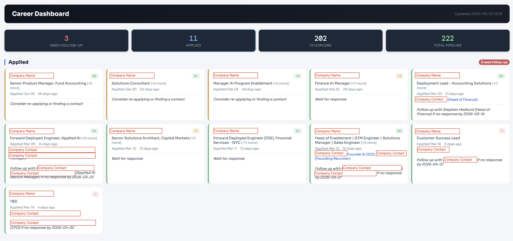
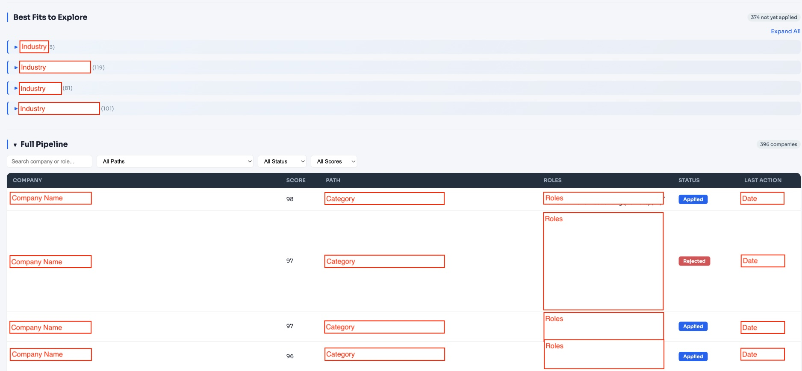

# Career Manager Pipeline

An AI-assisted career management system built as a set of Claude Code skills. Orchestrates job discovery, company research, application tracking, and resume tailoring through a pipeline of Python scripts and Claude Code interactions.

> **Note:** This is a personal productivity tool shared for inspiration and adaptation, not a production service.

## Screenshots

**Career Dashboard** -- track applications, scores, follow-ups, and contacts at a glance.



**Pipeline View** -- discover and score companies across your target industries.



## Demo

[](https://youtu.be/L-8e5EkNv1w)

**[Watch the 1-minute demo on YouTube](https://youtu.be/L-8e5EkNv1w)**

## Getting Started

The simplest way to run this is the **Claude Code desktop app** — no terminal needed, and the only thing you install yourself is the app.

1. Download the [Claude desktop app](https://claude.ai/download) and sign in
2. Open it and switch to the **Code** tab
3. Start a new session in the folder where you want the project (e.g. Documents), and paste this prompt:

   > Clone https://github.com/muggl3mind/career-manager.git, install any tools it needs that are missing (like uv and Python), and start onboarding.

Claude takes it from there: it clones the project, installs uv and Python if your computer doesn't have them, sets up dependencies, and starts the onboarding interview. When it asks permission to run a command, click **Allow** — the repo ships a permission allowlist (`.claude/settings.json`), so there are only a few of these.

<details>
<summary><b>Prefer the terminal?</b> Claude Code CLI instructions</summary>

Install the [Claude Code CLI](https://docs.anthropic.com/en/docs/claude-code/overview), run `claude` in the directory where you want the project, and paste the same prompt as above.

**Tip:** To let the pipeline run without any permission prompts, start Claude Code with:
```bash
claude --dangerously-skip-permissions
```
> **Caveat:** This bypasses *all* permission checks, not just for this pipeline. Only use this in a directory you trust and understand.
</details>

## Onboarding

Onboarding is a guided interview. Here's what you do vs. what Claude does:

**You:**
1. Provide your resume file path when asked
2. Answer one question with four parts: target roles, salary floor, location preferences, and job markets
3. Review the career paths Claude proposes and confirm (or tweak)

**Claude:**
- Reads your resume and extracts your background
- Derives 4-5 career paths from your experience and targets
- Generates all config files automatically:
  - `config.yaml` -- pipeline settings
  - `job-search/references/criteria.md` -- scoring rubric
  - `job-search/references/background-context.md` -- professional summary
  - `job-search/data/search-config.json` -- search queries and filters
- Runs a smoke test to verify everything works
- Hands off to the job search pipeline when ready

> **Manual setup:** Onboarding is the recommended way to generate the personalized files. `criteria.md` and `background-context.md` are not shipped in the repo and are only created by onboarding. `search-config.json` ships as a neutral stub with `setup_required: true`; the pipeline will not run until it is personalized. To configure it by hand, copy `job-search/data/search-config.json.example` over `job-search/data/search-config.json`, replace the placeholder values, and set `setup_required` to `false`. Manual editing of the other files is for customizing them *after* onboarding has created them.

## How to Use

Open the project in Claude Code (the desktop app's **Code** tab, or `claude` in a terminal) and describe what you need in plain English:

| What you want | What to say |
|---------------|-------------|
| Find new companies | *"Run the job search pipeline"* |
| Research a specific company | *"Research Stripe for me"* |
| Tailor your resume for a role | *"Tailor my CV for the Product Manager role at Stripe"* |
| Track an application | *"Add Stripe PM to my tracker"* |
| Check what needs follow-up | *"Show me applications that need follow-up"* |
| Run a health check | *"Run the pipeline health check"* |

You don't need to memorize commands. Just describe what you need and Claude will route to the right skill.

## Skills Overview

| Skill | Purpose | Entry Point |
|-------|---------|-------------|
| **job-search** | Discover companies, score against career paths, maintain target list | `job-search/SKILL.md` |
| **job-tracker** | Track application status, follow-ups, pipeline reports | `job-tracker/SKILL.md` |
| **company-research** | Deep dossier on a single company (overview, signals, fit, risks) | `company-research/SKILL.md` |
| **cv-tailor** | Generate tailored resume + cover letter for a specific role | `cv-tailor/SKILL.md` |
| **evals** | Pipeline quality assurance (code review, runtime verify, health monitor) | `evals/SKILL.md` |
| **onboarding** | Personalized pipeline setup via guided interview | `onboarding/SKILL.md` |

## Pipeline Flow

### Job Search (how companies are discovered)

When you say "run the job search pipeline", this happens:

```
Phase 1 -- Python exports (automated)
  +-- JobSpy scrape: searches job boards for matching listings
  +-- Monitor export: identifies known companies due for a recheck
  +-- Prospecting export: prepares per-career-path context files

Wave 1 -- Parallel search agents
  +-- Monitor agent: visits careers pages of known targets, checks for new roles
  +-- Eval agent: scores JobSpy results against your criteria rubric
  +-- Prospecting agents (1 per career path): 4-step research protocol
      +-- Market mapping: find 10-15 prominent companies
      +-- Competitor expansion: search top results for alternatives
      +-- Funding sweep: find recently-funded companies
      +-- Careers check: classify each as active_role or watch_list

Expansion prep -- Optional. Python generates secondary context from Wave 1 results only when --expand is passed

Wave 2 -- Optional parallel expansion agents (paths with 3+ Wave 1 results)
  +-- Uses Wave 1 top performers as seeds
  +-- Competitor mining: alternatives to seed companies
  +-- Investor portfolio mining: portfolio companies of seed investors
  +-- Community/list mining: curated lists, YC batches, awesome-lists
  +-- Returns only new companies scoring above the discovery threshold (no minimum quota)

Phase 2 -- Python merges all results into target-companies.csv

Phase 3 -- Generates ranked action list + dashboard
  +-- Coverage check: flags thin career paths
  +-- Run diff: alerts on score changes or removed high-scorers
  +-- Action list: ranked by score with priority tiers (HIGH/MED/LOW)
```

The eval agent reads `job-search/data/pending-eval.json` for batches of 40 or fewer jobs. Larger batches are split into `pending-eval-shard-N.json` files so each eval agent can handle one shard.

Known companies are rechecked through a monitor cadence gate. Recently verified companies are skipped by default for 7 days, while applied, interviewing, and offer-stage companies are always included. Unreachable `fetch_empty` checks stay retryable on the next run.

### End-to-end career workflow

```
1. Discover companies (job-search)
2. Score & rank them (job-search)
3. Deep-dive a specific company (company-research)
4. Tailor your CV for a role (cv-tailor)
5. Track your application (job-tracker)
6. Follow up on stale applications (job-tracker)
```

Each skill has its own `SKILL.md` with detailed usage instructions.

## Customization

- **Career paths**: Edit `job-search/references/criteria.md` to define your own target industries and scoring rubric
- **Scoring weights**: Adjust the 10-dimension rubric in `job-search/references/criteria.md`

## Optional: Tavily Integration

Get direct links to specific job postings instead of generic careers pages. Free tier: 1,000 credits/month.

1. Sign up at [tavily.com](https://tavily.com) and get an API key
2. Create the directory if needed (`mkdir -p .credentials`), then save the key as `.credentials/tavily-token.json`: `{"api_key": "tvly-your-key"}`
3. Set `tavily_enabled: true` in `config.yaml`

## Architecture

Each skill owns its data and exposes clear interfaces:

- `job-search/data/target-companies.csv` -- Source of truth for discovered companies and company lifecycle
- `job-search/data/opportunities.csv` -- Source of truth for actionable roles generated from the pipeline
- `job-tracker/data/applications.csv` -- Source of truth for submitted/researched applications
- `company-research/dossiers/*.md` -- Deep research output
- `cv-tailor/data/CV/[company]/` -- Per-company tailored materials

See `references/ownership-matrix.md` for the full ownership map.
